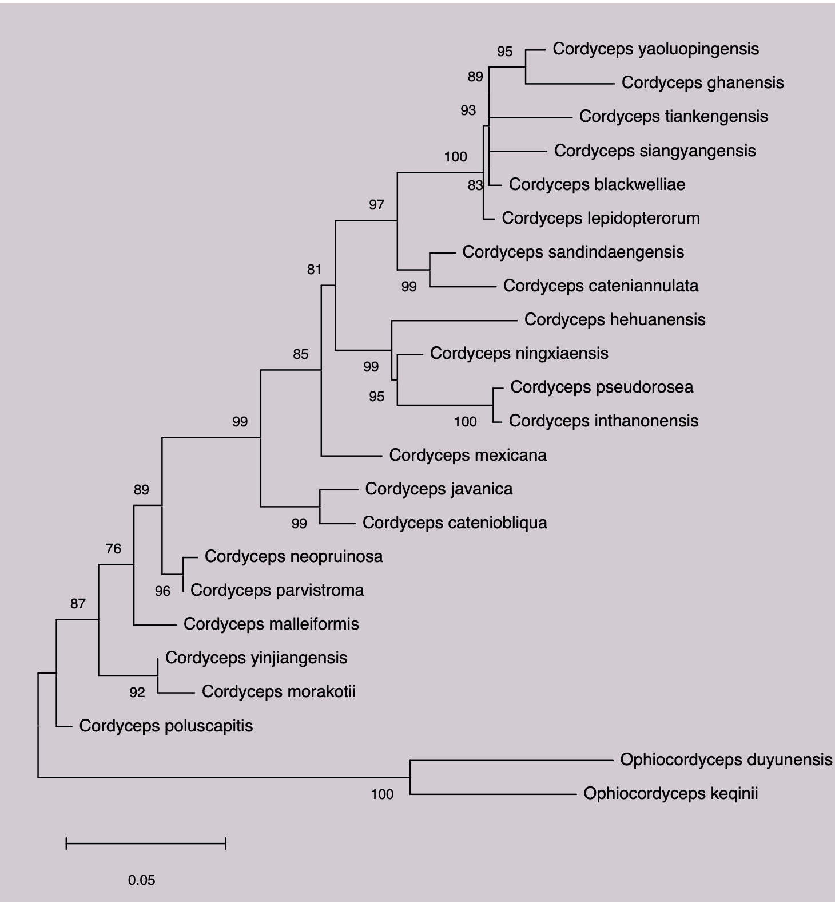
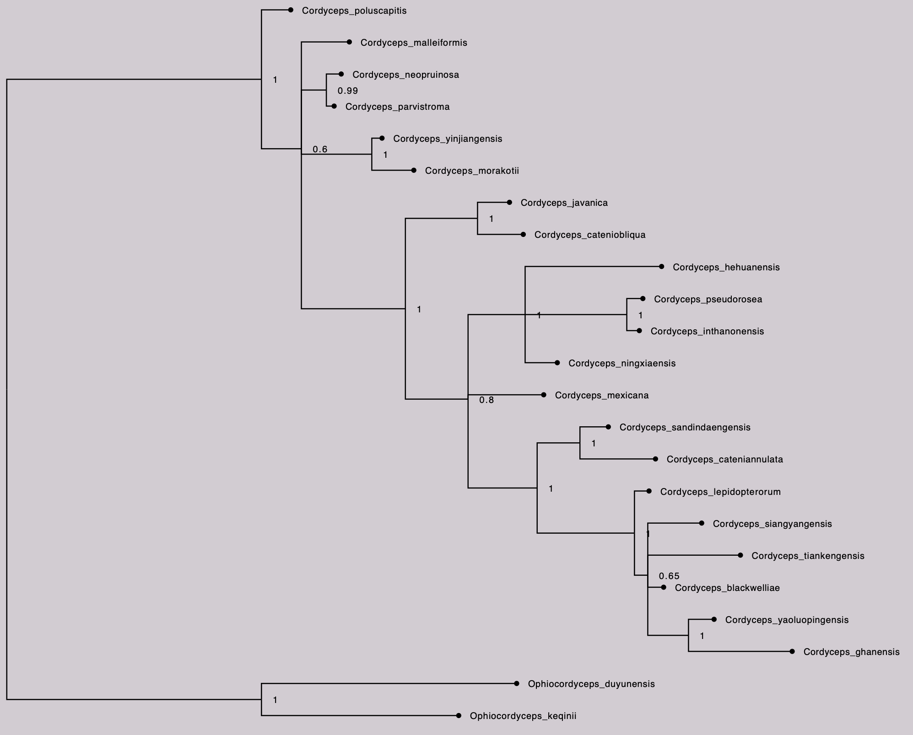

# cordyceps-phylogenetic-analysis

This project was completed as part of my undergraduate studies in Molecular Biology and Genetics.

The aim of the study was to investigate phylogenetic relationships among Cordyceps species and examine host-specific adaptations using sequence-based phylogenetic analysis.

## Tools Used

- MEGA
- MrBayes
- FigTree
- NCBI databases

## Project Content

The project includes sequence analysis, phylogenetic tree construction, Bayesian inference, and tree visualization.

## Results

### Maximum Likelihood Tree

The Maximum Likelihood phylogenetic tree was generated in MEGA. 
Node values represent bootstrap support.

### Bayesian Phylogenetic Tree

The Bayesian phylogenetic tree was generated using MrBayes and visualized in FigTree. 
Node values represent posterior probability support.
